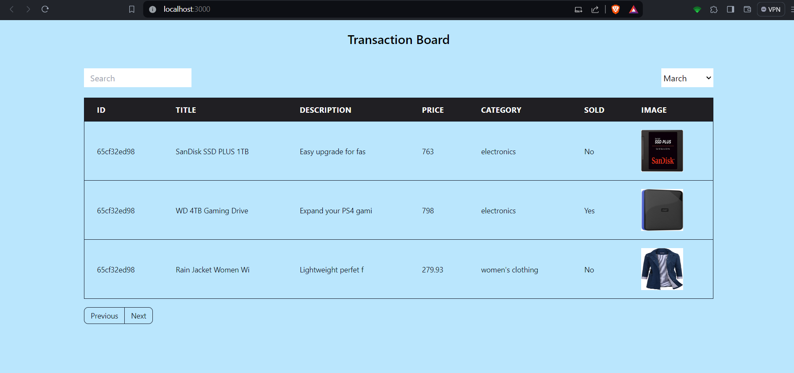
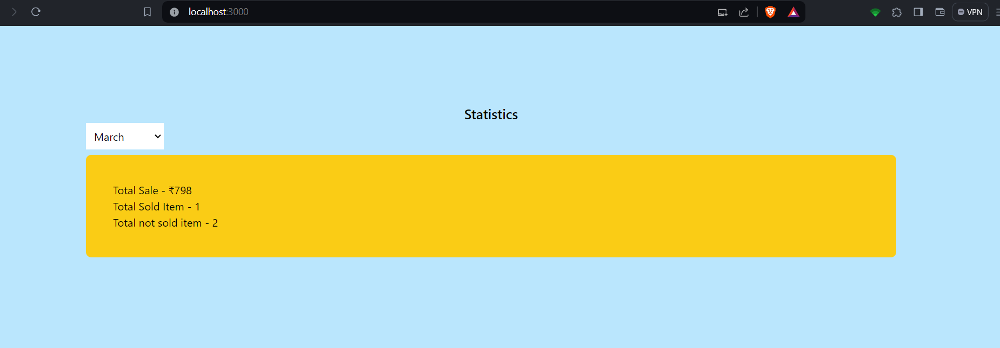
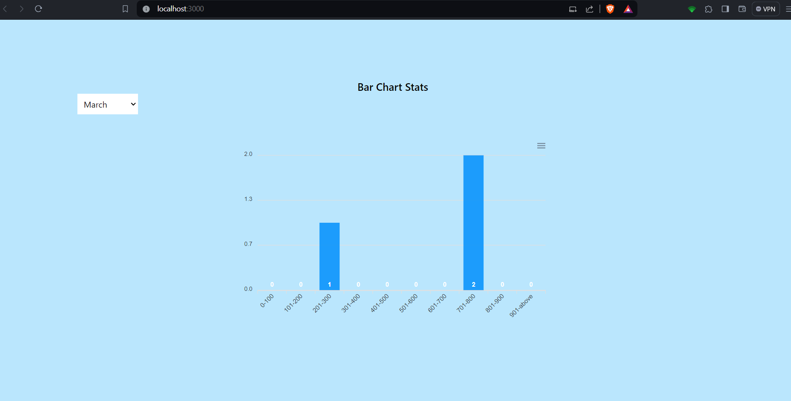

## How to run the application

Firstly open client and server in two different terminals, then do `npm i` to install node_modules.

Create a `.env` file in server directory and add this `MONGO_URI=mongodb://0.0.0.0:27017/productdb`

Then run the following command `node seed.js -i` in server directory to seed the dummy data in mongoDB.

Then run the following command `npm start` in both client and server directories to start the application.

All the data shown here is dynamic and coming directly from mongoDB, you can change the selected month to see the data of different months.

